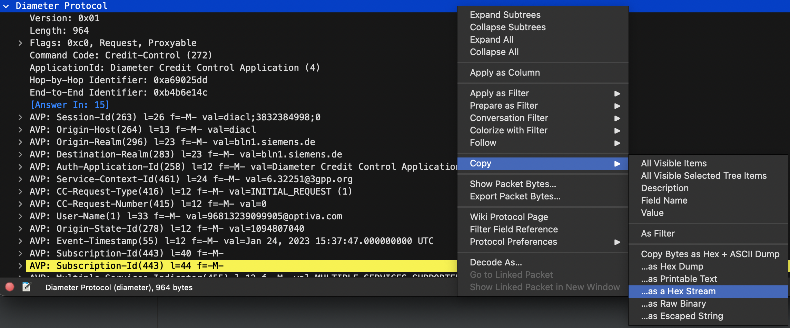

# DiameterClientServer
Simple Java Diameter Client Server Implementation

DiameterClient is to be used with `server-ipd` and `port` parameters

Update hard coded message fields like CCR_I, CCR_U and CCR_T, corresponding as initial, update and termination signals.

Hardcoded messages were taken from a TCP Dump from wireshark by selecting diameter layer > right click > copy > as Hex Stream

