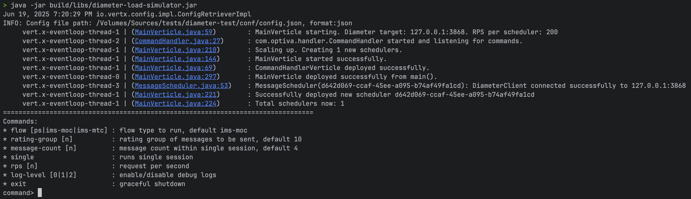
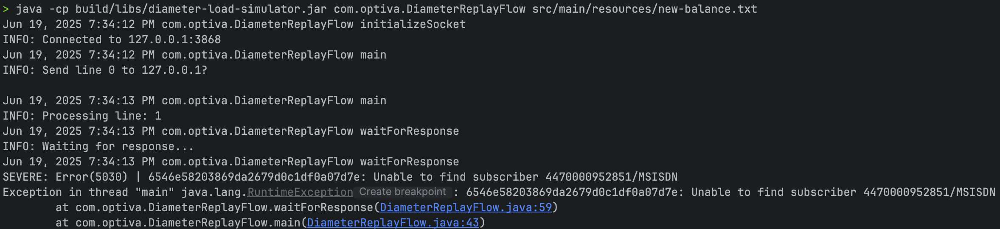
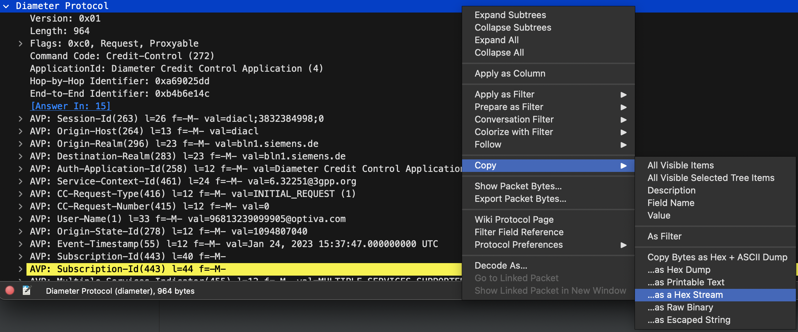

# DiameterClient

A Simple diameter load simulator

2 modes are available:

1. Interactive mode
2. Packet replay

## 1. Interactive mode

```shell
./gradlew clean assemble
java -jar build/libs/diameter-load-simulator.jar
```



> You can simply send single session using `single` command.
>
> Or you can start a load with `rps 10` that will start a load with `ìms-moc` flow with 10 requests per second

---

## 2. Packet replay

```shell
./gradlew clean assemble
java -cp build/libs/diameter-load-simulator.jar com.optiva.DiameterReplayFlow test.txt
```



> Simply you send each line of hexstream in the file by pressing enter
> Once the lines finishes or an error response was returned program will exit

### How to prepare a replay file

You need to open a tcpdump and copy diameter packages as hexstream as shown in figure below.

**The important part is** each request should be in single line and no empty lines is expected or else you may see some
errors on console.

